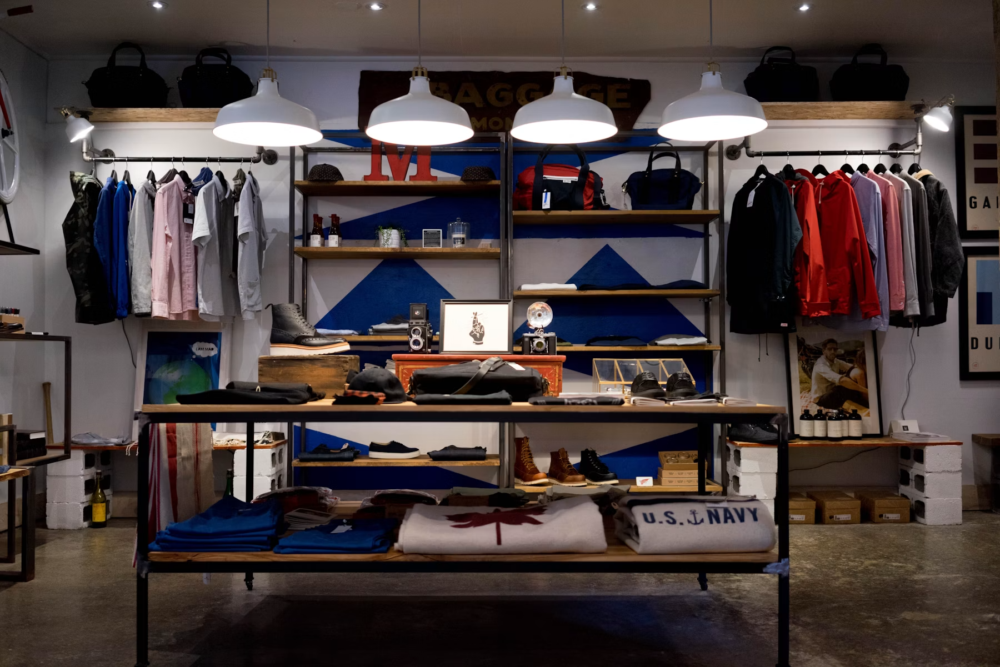

<p align="center">
  
</p>
<h1 align="center">URBAN <span>SHOP</span></h1>
<p align="center"><strong>Tu estilo. Tu momento.</strong></p>
<p align="center">E-commerce Frontend de Productos Urbanos.</p>

---
## 🖥️ Enlaces Directos:

<p align="center"> •
  <a href="#proyecto">Proyecto</a> •
  <a href="#caracteristicas">Características</a> •
  <a href="#tecnologias_tipografia">Tecnologías & Tipografia</a> •
  <a href="#estructura">Estructura</a> •
  <a href="#instalacion">Instalación</a> •
  <a href="#estado">Estado</a> •
  <a href="#creditos">Créditos</a> •
</p>

---

<h2 id="proyecto">✨ Sobre el Proyecto</h2>

**Urban Shop** es un ecommerce frontend moderno enfocado en la estética urbana. Permite explorar un catálogo dinámico, gestionar el carrito de compras con persistencia local, calcular envíos, enviar consultas vía **EmailJS** y simular transacciones con notificaciones interactivas de **SweetAlert2**.

* **Stack:** HTML5, CSS3, Vanilla JavaScript, EmailJS, SweetAlert2.
* **UX/UI:** Diseño responsive, accesibilidad básica y modo adaptativo Desktop/Mobile.

---

## 🖥️ Preview

<p align="center">
  
</p>

---

<h2 id="caracteristicas">🚀 Características Principales</h2>

| Módulo | Descripción |
| :--- | :--- |
| 🛍️ **Catálogo & Carrito** | Filtrado de productos, control de cantidades, subtotal automático y persistencia con `localStorage`. |
| 🚚 **Cálculo de Envío** | Avisos dinámicos en el carrito sobre montos faltantes para bonificación. |
| 📧 **Formulario EmailJS** | Envío de correos directos desde el cliente con validaciones y alertas de éxito/error. |
| 🔔 **SweetAlert2** | Modales interactivos, *Toast notifications* y simulación de resumen de compra. |
| 📱 **Responsive & Multimedia** | Menú hamburguesa fluido, grilla de reseñas adaptativa y videos del e-commerce. |

---

<h2 id="tecnologias_tipografia">🛠️ Tecnologías & Tipografía</h2>  

* **Tipografía:** Montserrat (Google Fonts)

* **Tecnologías Utilizadas:**
<p align="center">
  
  
  
  
  
</p>

---

<h2 id="estructura">📂 Estructura del Proyecto</h2>

```text
e-commerce_tt/
│
├── 📁 assets/
│   ├── 📁 img/ (favicon, hero, banner, etc.)
│   └── 📁 video/ (urban_shop.mp4, new_look.mp4)
│
├── 📁 src/
│   ├── 📁 css/ (styles.css)
│   └── 📁 js/ (app.js)
│
├── 📄 index.html
└── 📄 README.md

```

<h2 id="instalacion">⌛ Instalación del Proyecto</h2>

## Cloná el Repositorio:

```Bash
  git clone [https://github.com/Juan-Manuel-JMP/e-commerce_TT.git](https://github.com/Juan-Manuel-JMP/e-commerce_TT.git)

```
## Entrá a la Carpeta:

```Bash
cd e-commerce_tt

```
## Ejecutá el Proyecto:
 Abrí index.html en tu navegador o utilizá la extensión Live Server en Visual Studio Code.

<h2 id="estado">⚙️ Estado del Proyecto</h2>

| Funcionalidad | Estado | Funcionalidad | Estado |
| :--- | :---: | :--- | :---: |
| 🛍️ Catálogo | ✅ | 📱 Responsive | ✅ |
| 🛒 Carrito & LocalStorage | ✅ | 🎬 Multimedia | ✅ |
| 🚚 Envío automático | ✅ | ⭐ Reseñas | ✅ |
| 🔔 SweetAlert2 / EmailJS | ✅ | 💳 Simulación de Pago | ✅ |

<br>

<h2 id="creditos"> Créditos</h2>

<div align="center">
  <table>
    <tr>
      <td align="center" width="800">
        <h3>👨‍💻 Creado por <strong>Juan Manuel Parylak</strong></h3>
        <p>Hecho con ❤️ usando HTML5, CSS3 y JavaScript.</p>
        <hr style="border: 0; border-top: 1px solid #eaeaea; margin: 10px 0;">
        <p style="font-size: 13px; color: #777777;">
          © 2026 <strong>Urban Shop</strong> · Todos los Derechos Reservados.
        </p>
      </td>
    </tr>
  </table>
</div>
